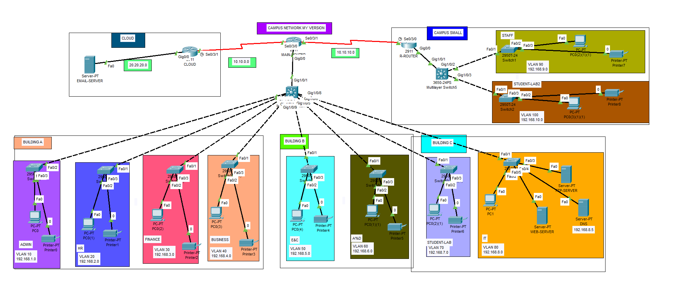

# NETWORK-CAMPUS-CISCO
# Campus Network in Cisco Packet Tracer

A multi-building campus network with VLAN segmentation per department, RIP v2 routing between sites, and core services (DNS, Web, FTP, Email) built and tested in Cisco Packet Tracer.

## Features

- Three buildings (A, B, C) and a separate HQ block, each split into department VLANs
- Central multilayer switch connecting all building access switches
- Two remote sites linked over serial WAN links with RIP version 2
- Simulated cloud segment hosting the email server
- DNS, Web, FTP and Email (SMTP + POP3) services

## Topology

| Segment | Devices |
|---|---|
| Cloud | EMAIL-SERVER (20.20.20.2), router CLOUD |
| Campus core | Edge router, core multilayer switch |
| Building A | 4 access switches, 4 VLANs |
| Building B | 2 access switches, 2 VLANs |
| Building C | 2 access switches, 2 VLANs (including the server VLAN) |
| HQ | Router, multilayer switch, 2 access switches |

Each department zone contains an access switch, a PC and a printer.

## VLAN and addressing plan

| VLAN | Name | Subnet | Location |
|---|---|---|---|
| 10 | ADMIN | 192.168.1.0/24 | Building A |
| 20 | HR | 192.168.2.0/24 | Building A |
| 30 | FINANCE | 192.168.3.0/24 | Building A |
| 40 | BUSINESS | 192.168.4.0/24 | Building A |
| 50 | E&C | 192.168.5.0/24 | Building B |
| 60 | A&D | 192.168.6.0/24 | Building B |
| 70 | STUDENT-LAB | 192.168.7.0/24 | Building C |
| 80 | IT | 192.168.8.0/24 | Building C (servers) |
| 90 | STAFF | 192.168.9.0/24 | HQ |
| 100 | STUDENT-LAB2 | 192.168.10.0/24 | HQ |

Cloud segment: 20.20.20.0/24. Serial WAN links use the 10.10.10.x range.

## Services

| Service | Details |
|---|---|
| DNS | 192.168.8.5, VLAN 80 |
| Web | WEB-SERVER, VLAN 80 |
| FTP | FTP-SERVER, VLAN 80 |
| Email | EMAIL-SERVER, 20.20.20.2, domain campus.com, SMTP and POP3 enabled |

The DNS server holds an A record for `mail.campus.com` pointing to `20.20.20.2`, so mail clients use the domain name instead of the IP address.

## Routing

RIP version 2 runs on the routers and connects the cloud segment, the campus and the HQ block.

## Verification

- Mail sent between two clients in different sites is delivered through the email server
- `mail.campus.com` resolves to `20.20.20.2` via the DNS server
- POP3 retrieval succeeds from the client mail browser

## Tools

Cisco Packet Tracer
